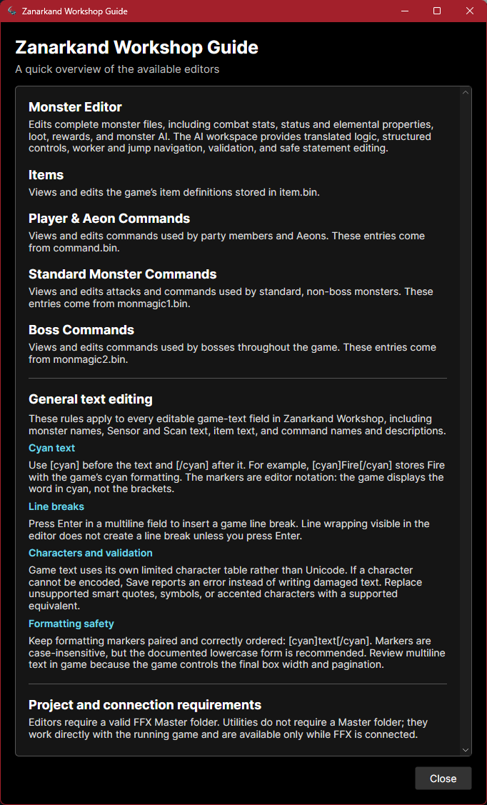

# Zanarkand Workshop

<p align="center">
  
</p>

> **Forked with permission from original author:** This project is based on
> [osdanova/FFXProjectEditor](https://github.com/osdanova/FFXProjectEditor),
> originally created by osdanova. This fork is independently maintained and is
> not affiliated with or endorsed by Square Enix.

An unofficial Final Fantasy X modding toolkit for Windows. Zanarkand Workshop
uses its own version numbering beginning at v0.1.0 and was derived from FFX
Project Editor v1.2.

The current release is **v0.2.0**, featuring expanded Battle Script editing,
safer recovery workflows, improved command editors, and clearer validation.

If you only want to use the Utilities, simply open the app when the game is open and use them, no need to set anything up.

* Utilities are only compatible with the Windows Steam version.
* Utilities are compatible with [Untitled Project X](https://steamcommunity.com/sharedfiles/filedetails/?id=683802394).
* To refresh Utility data, it has to be reopened (excluding the Battle Tracker).

## How to set it up

Download the latest Windows package from the Releases section of this fork,
extract it, and run `ZanarkandWorkshop.exe`.

Extract the game files using an extractor such as [VBF Browser](https://www.nexusmods.com/finalfantasy12/mods/3).

The folder that the app uses (and needs to be loaded) is `ffx_ps2/ffx/master`.
Inside this folder are directories containing data for every region. Currently,
this tool only supports US game data; both `new_uspc` and `jppc` are needed.

I recommend using the [External File Loader](https://www.nexusmods.com/finalfantasyxx2hdremaster/mods/150).
This creates a `mods` folder inside your FFX folder where custom files can be
loaded by the game. Once installed, copy your `master` folder to
`mods/ffx_ps2/ffx/` and load that folder in the editor to immediately modify
the files used by the game.

**It is also recommended that you keep a clean version of the master files, as
they are needed for the recovery feature of this program.**

## How to use

Click **Open Project Folder...** and select your master folder. The app detects
the running game automatically; the **FFX Connected** indicator shows the
connection status.



## File Editors

* Available when a master file is selected and confirmed.

### Monster Editor

* Live testing: Monster changes are loaded when combat starts, so a saved
  monster file applies to the next encounter.

Edit monster stats, elemental affinities, status resistances, loot drops, and
other properties.

The Battle Script editor can change attacks, targets, conditions, jumps, shared
values, and other monster behavior. v0.2.0 adds safer structural copying,
insertion, replacement, and deletion; worker/function/jump navigation; protected
`RETURN (3C)` handling; transactional manual hex validation; and recoverable
rejected edits.


### Items

* Live testing: Loaded when the game starts. The **Load Ingame** button can be
  used to see changes without restarting.

Edit item names, descriptions, targeting, effects, formulas, elements, statuses,
and related properties.


### Player & Aeon Commands

Edit the commands used by the party and Aeons.


### Standard Monster Commands

Edit commands used by standard enemies.


### Boss Commands

Edit commands used by bosses.


## General text editing

These rules apply across editable game-text fields in Zanarkand Workshop,
including monster names, Sensor and Scan text, items, and command names and
descriptions.

### Cyan formatting

Wrap text in `[cyan]` and `[/cyan]` to use the game's cyan formatting:

```text
Weak against [cyan]Fire[/cyan].
```

The tags are editor notation. In the game, `Fire` is displayed in cyan and the
brackets are not shown. Tags are case-insensitive, although the lowercase form
is recommended. Keep opening and closing tags paired and correctly ordered.

### Line breaks

Press Enter in a multiline field to insert a game line break. Visual wrapping
inside an editor field does not insert a line break unless Enter was pressed.
The game controls the final text-box width and pagination, so review longer
text in game.

### Supported characters and validation

FFX uses its own limited character table rather than Unicode. If text contains
a character that cannot be encoded, Zanarkand Workshop reports an error instead
of writing damaged text. Replace unsupported smart quotes, symbols, or accented
characters with a supported equivalent and save again.

## Utilities

* Available only while an active session of FFX is running.
* Zanarkand Workshop will automatically connect.
* Check **FFX Connected** in the top-right corner for confirmation.

Tools to play around with the game.

### Debug Menu

Resides inside the Utilities menu. A configuration menu with debug options.

### Battle Tracker

A menu to see and modify ally and enemy data. Autorefresh can be enabled, but
editing and loading data is disabled while it is autorefreshing.

### Inventory Tracker

See all of your inventory and edit it as needed. You can also sell equipment in
bulk.

### Arena Tracker

Keep tabs on your arena captures.

## Made with

* .NET
* Avalonia UI
* MemorySharp (compiled branch that supports x64 apps)

## Building from source

Requirements:

* Windows
* [.NET 8 SDK](https://dotnet.microsoft.com/download/dotnet/8.0)

From the repository root:

```powershell
dotnet restore .\ZanarkandWorkshop.sln
dotnet build .\ZanarkandWorkshop.sln -c Release --no-restore
```

The executable is written to
`ZanarkandWorkshop/bin/Release/net8.0/ZanarkandWorkshop.exe`.

To create the ready-to-distribute, self-contained Windows ZIP used for GitHub
Releases:

```powershell
.\scripts\build-release.ps1 -Version 0.2.0
```

The package is written to `artifacts/ZanarkandWorkshop-v0.2.0-win-x64.zip`.
Pushing a version tag such as `v0.2.0` runs the same packaging process on
GitHub and creates a draft release for review.

## Project status

Zanarkand Workshop is under active development. Back up modded game files before
editing them and review the release notes before upgrading. Version 1.0.0 is
reserved for a future stable milestone.

See [CHANGELOG.md](CHANGELOG.md) for release history and [NOTICE.md](NOTICE.md)
for project provenance and licensing information.

## Special Thanks

The knowledge on the files was shared by the FFX community folks. Check out the
[Fahrenheit project](https://github.com/peppy-enterprises/fahrenheit/tree/main)
to learn more.

Big thanks to [Karifean/FFXDataParser](https://github.com/Karifean/FFXDataParser)
and their knowledge of monster Battle Script structure.

Another big thanks to the
[Cid's Salvage Ship](https://discord.gg/yAQc3ngwDF) Discord community. They've
been an enormous help with FFX modding. Check them out if you're interested.
